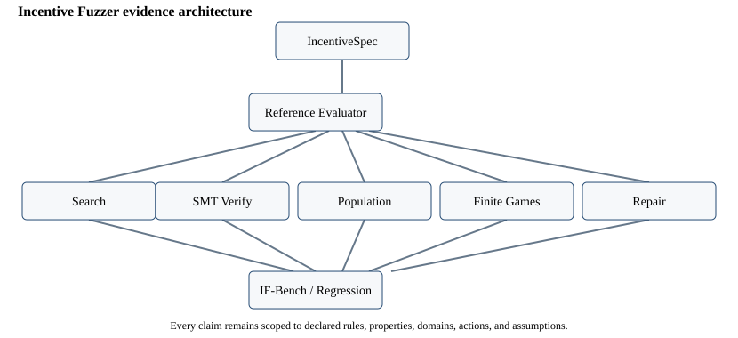

# Incentive Fuzzer

**Adversarial Testing for Economic Rules**

[](https://doi.org/10.5281/zenodo.22982554)

Economic rules create incentives. Sometimes an actor can profit by changing behavior in a way the rule designer did not intend. Incentive Fuzzer treats bounded economic rules like software under adversarial testing: specify the rule and feasible actions, search for counterexamples, replay them exactly, formally cross-check supported cases, and regression-test proposed repairs.

This repository is a **research preview**, not a production policy-auditing system. It was created by Aayush Kadam.

## What it is

Incentive Fuzzer is a research prototype for adversarially testing bounded economic rules. It combines deterministic rule execution, candidate search, replayable counterexamples, exact-rational SMT verification, heterogeneous sensitivity analysis, finite strategic games, bounded repair search, and a blind benchmark protocol.

The contribution under study is the unified audit workflow and evidence format—not the invention of mechanism design, formal verification, fuzzing, equilibrium analysis, or policy simulation.

## Why it exists

Ordinary examples often exercise the expected path through a rule. Incentive failures live near boundaries, in reporting choices, under heterogeneous costs, or in interaction with other actors. The project asks a narrower and auditable question:

> Within a declared model, domain, and action space, is there a feasible deviation that improves private utility while violating an explicit property?

Every result remains conditional on those declarations.

## Minimal example

```powershell
incentive-fuzzer validate examples\scholarship_cliff.yaml
incentive-fuzzer search examples\scholarship_cliff.yaml --method boundary
incentive-fuzzer verify examples\scholarship_cliff.yaml --action reduce_work
```

The synthetic scholarship rule has a hard cutoff. Search returns a replayable downward-work counterexample; verification returns `FORMALLY_VIOLATED` for the declared finite domain. Neither status predicts real recipient behavior.

## Architecture

```text
Rule / IncentiveSpec v0.1
          ↓
Deterministic reference evaluator
    ├── bounded search and reduction
    ├── independent exact-rational SMT verification
    ├── heterogeneous population sensitivity
    ├── finite strategic-game analysis
    └── bounded repair generation
                    ↓
          regression re-attack
                    ↓
          IF-Bench / evidence package
```

The evaluator is the replay oracle. Candidate generators and solver witnesses do not become evidence until replayed where applicable. See `docs/ARCHITECTURE.md` and `research/m8_entry/architecture.svg`.



## What it can currently do

- Parse and validate the restricted IncentiveSpec v0.1 language.
- Evaluate one-agent, one-period deterministic rules with exact decimal arithmetic.
- Search bounded state/action domains using exhaustive, boundary, seeded-property, grid, and combined methods.
- Reduce and deterministically replay counterexamples.
- Formally check profitable-deviation existence in the supported exact-rational fragment.
- Aggregate declared heterogeneous types under B0/B1/B2 behavioral scenarios.
- Enumerate pure-strategy Nash equilibria in small finite simultaneous games.
- Generate and regression-test bounded parameter or phase-out repair candidates.
- Run IF-Bench v0.1 without exposing hidden labels to the runtime evaluator.

## What it cannot do

It does not provide complete program audits, representative real-world accuracy, behavioral prevalence forecasts, legality determinations, welfare analysis, arbitrary formal verification, mixed or dynamic equilibrium prediction, general mechanism synthesis, or optimal policy recommendations. External rules are partially encoded; actions, valuations, and pathology mappings remain project-authored. Independent economist/domain review has not yet been completed.

## Quickstart

Python 3.12 is required.

```powershell
git clone https://github.com/Aayush-Kadam/incentive-fuzzer.git
cd incentive-fuzzer
python -m venv .venv
.venv\Scripts\python -m pip install --upgrade pip
.venv\Scripts\python -m pip install -e ".[test]"
.venv\Scripts\python -m pytest
.venv\Scripts\incentive-fuzzer --help
```

On macOS or Linux, replace `.venv\Scripts\` with `.venv/bin/`.

## CLI

```text
incentive-fuzzer validate SPEC
incentive-fuzzer evaluate SPEC --state JSON [--action NAME --controls JSON]
incentive-fuzzer search SPEC [--method combined]
incentive-fuzzer verify SPEC --action NAME
incentive-fuzzer benchmark [--suite benchmarks/if_bench/v0.1] [--method combined]
```

Commands emit structured JSON and preserve qualified statuses such as `VIOLATION_FOUND`, `FORMALLY_VIOLATED`, `FORMALLY_SATISFIED_WITHIN_DOMAIN`, and `NO_VIOLATION_FOUND_WITHIN_BUDGET`. They never collapse results into “safe” or “unsafe.”

## Python API

```python
from incentive_fuzzer import load_spec, evaluate, search_spec, verify_spec, run_benchmark

spec = load_spec("examples/scholarship_cliff.yaml")
search_result = search_spec("examples/scholarship_cliff.yaml", method="boundary")
formal_result = verify_spec("examples/scholarship_cliff.yaml", action="reduce_work")
```

Layer-specific advanced classes remain available from their modules. The convenience API is documented in `docs/PUBLIC_API.md`.

## Example findings

The flagship synthetic scholarship example reduces to a one-unit income change at the cutoff with a modeled private gain of 99,999. The strategic-complementarity example has no profitable manipulation against an honest rival (`-2`) but has a profitable response against a manipulating rival (`+2`), producing both `(H,H)` and `(M,M)` equilibria.

Run:

```powershell
python scripts\demo_scholarship.py
python scripts\demo_strategic_game.py
python scripts\demo_external_case.py
```

## Formal verification

The independently authored M3 backend uses exact rational Z3 constraints for a restricted QF_LIRA fragment. It matched 500/500 generated fixed-input cases and 12/12 frozen M2 statuses. M7.5's SMT-only baseline supports 26/30 IF-Bench cases: 15 formal violations, 11 scoped satisfactions, four explicit unsupported adapters, no timeout or unknown, and 15/15 violating-witness replays.

Formal conclusions cover one property—profitable-deviation existence—and only the declared domain and actions.

## Population robustness

M4 aggregates synthetic heterogeneous agent types with fixed frictions, cost multipliers, and declared response scenarios. In the registered scholarship grid, the hard cutoff had B0 profitable share 0.515625 and the phase-out had zero. This is sensitivity analysis, not an estimate of human behavior.

## Strategic interaction

M5 provides exact pure-strategy analysis for small, deterministic, simultaneous, complete-information games. Multiple equilibria and schedule-dependent dynamics are reported without selecting or forecasting an outcome.

## Repair regression

M6 searches small parameter grids and one structural hard-cutoff-to-phase-out family. Candidates are re-attacked across applicable search, formal, population, game, and mutation layers. A deliberately coupled repair fixed an isolated exploit but created `(M,M)` and was rejected as `REPAIR_INDUCED_VULNERABILITY`. Repairs are technical counterfactuals, not recommendations.

## IF-Bench

IF-Bench v0.1 contains 30 bounded cases, including ten externally sourced rule components, six historical components, ten negative controls, and six holdouts; categories overlap.

- Historical encoded-component rediscovery: **5/6**.
- Positive holdouts detected: **4/4**; negative holdout findings: **0/2**.
- Negative controls clean: **10/10**.
- Boundary-only and combined search both detected 19 cases, but boundary-only used 369 candidate evaluations versus 1,261.
- Arizona remains a preserved miss because the sourced transition thresholds did not justify the additive valuation needed for the expected composition pathology.
- Removing downward-adjustment or splitting actions eliminated every external finding.

These are curated component-level results, not representative auditing accuracy.

## Reproducibility

```powershell
python scripts\reproduce.py quick
python scripts\reproduce.py research
python scripts\reproduce.py full
```

- `quick`: public CLI, benchmark integrity, B5, and M7.5 checks.
- `research`: complete tests plus frozen headline tables and figure regeneration.
- `full`: research mode plus all three public demonstrations.

Each mode writes `reproducibility/manifest.json` with the Git commit, platform, dependencies, test count, seeds, benchmark checks, runtime, and artifact hashes. Detailed instructions are in `docs/REPRODUCIBILITY.md`.

## Project status

Version: **0.1.0 Research Preview**. The artifact is ready for external review, not production or policy use. The integrated technical report is `paper/INCENTIVE_FUZZER_RESEARCH_PREVIEW.md`; frozen claims are governed by `research/M8_ENTRY_CLAIM_LEDGER.md`.

## Limitations

The benchmark is small, US-heavy, scalar, and threshold-heavy. Boundary-only is highly competitive. External cases are partial and depend on project-authored threat models and normalized valuations. Formal verification is incomplete, population assumptions are synthetic, strategic games are finite and pure-strategy, and repair families are bounded. See `docs/LIMITATIONS.md`.

## External review status

**Independent economist/domain review has not yet been completed.** The `external_review/` package contains case cards, review questions, a response form, and a label-blind sealed-holdout template. Contributors should follow `CONTRIBUTING.md` and `docs/BENCHMARK_CONTRIBUTIONS.md`.

## Citation / author

Author and project lead: **Aayush Kadam**. Cite software version **v0.1.0-research-preview** using the version-specific DOI [10.5281/zenodo.22982554](https://doi.org/10.5281/zenodo.22982554). The [Zenodo record](https://zenodo.org/records/22982554), [GitHub release](https://github.com/Aayush-Kadam/incentive-fuzzer/releases/tag/v0.1.0-research-preview), and [research-preview PDF](paper/output/pdf/incentive-fuzzer-research-preview.pdf) identify the archived artifact. Citation metadata is provided in `CITATION.cff`. No institutional affiliation is asserted. External benchmark sources retain their own attribution and rights; see `bibliography/SOURCES.md` and the benchmark source registers.
